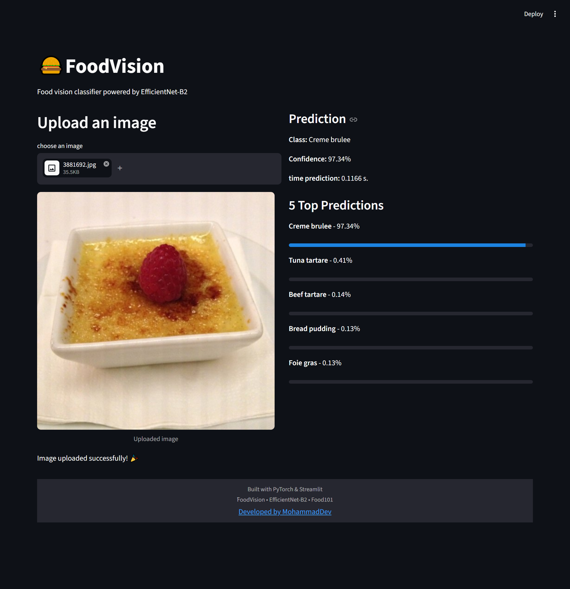

# 🍔 FoodVision - Food Image Classification

FoodVision is a deep learning image classification application built with PyTorch and EfficientNet-B2.
The model can classify food images into 101 categories from the Food101 dataset.

## Features

- Transfer Learning with EfficientNet-B2
- Fine-tuning last feature layers
- Data augmentation
- Label smoothing
- AdamW optimizer
- Early stopping
- Learning rate scheduling
- Optuna hyperparameter tuning
- Top-5 prediction
- Streamlit deployment

## Model Performance

- Test Accuracy: 64.5%
- Dataset: Food101 (10% subset)
- Architecture: EfficientNet-B2

## 📈 Training Experiments

| Experiment | Scheduler | Epochs | Best Val Accuracy | Test Accuracy |
|---|---|---|---|---|
| Baseline | None | 20 | 57.79% | - |
| StepLR | γ=0.1 | 20 | 43.02% | - |
| StepLR | γ=0.5 | 20 | 50.38% | - |
| CosineAnnealingLR | - | 20 | 48.75% | - |
| **Final Model** | **None** | **30** | **60.12%** | **64.51%** |

### Experiment Conclusion

Different learning rate scheduling strategies were tested.
The final model without scheduler achieved the best validation and test performance.

## 🔍 Hyperparameter Optimization

Optuna was used to optimize learning rates for different parameter groups:

- Backbone learning rate: `4.35e-5`
- Classifier learning rate: `5.02e-5`

The best parameters were selected based on validation performance.

## Tech Stack

- Python
- PyTorch
- Torchvision
- Streamlit

## Demo screenshot

## 🚀 Live Demo
Try the deployed application:

